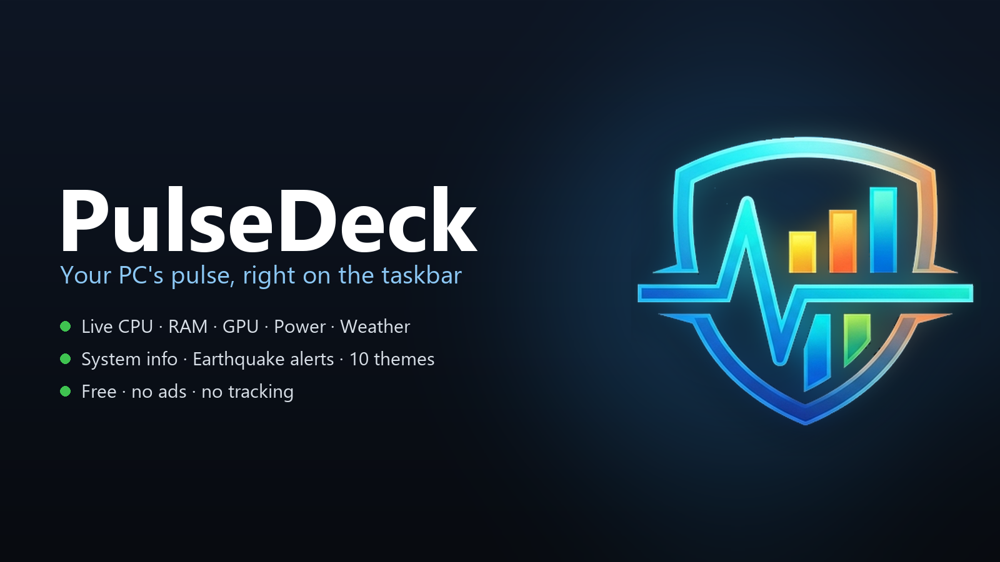
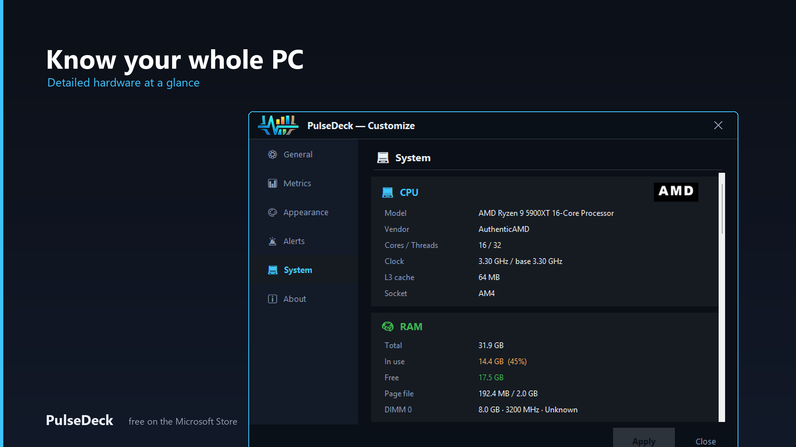
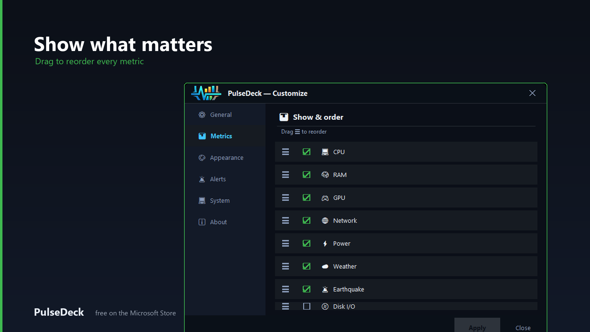
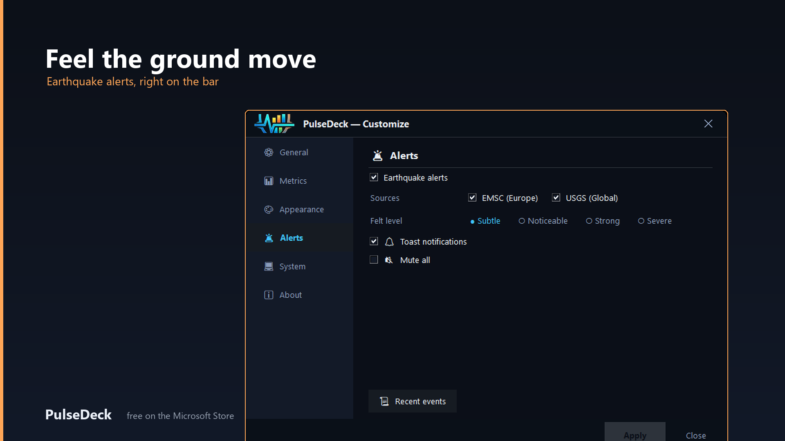

<p align="center">
  
</p>

<h1 align="center">PulseDeck</h1>

<p align="center"><sub><i>formerly PulseBar</i></sub></p>

<p align="center">
  <b>Your PC's pulse β€” right on the taskbar.</b><br>
  A lightweight system monitor that sits <b>on</b> your Windows 10/11 taskbar
  (or floats just above it) β€” always visible, never in the way. <b>Free.</b>
</p>

<p align="center">
  <a href="https://apps.microsoft.com/detail/9P128R4SVXLC">
    
  </a>
  <a href="../../releases/latest">
    
  </a>
</p>

<p align="center">
  
  
  
  
  
</p>



<p align="center">
  
</p>

<p align="center">
  
  
  
</p>

---

## ✨ Features

### Live metrics
- **CPU** β€” usage % (+ clock speed in GHz)
- **RAM** β€” usage % and **used / total GB**
- **GPU** β€” usage % + **VRAM used / total GB** *(via Windows performance counters β€” no extra tools)*
- **Network** β€” real-time upload β–² / download β–Ό (MB/s **or** Mbps)
- **Disk** — read **R** / write **W** speed, **+ per-drive space %** (C:, D: …)
- **Battery** — % with ⚡ charging indicator (laptops only)

### 🆕 Hover details (v2.4)
Point at any metric for a popup panel:
- **CPU** β†’ top processes + per-core bars Β· **RAM** β†’ top processes (GB)
- **GPU** → VRAM used / total · **Network** → session ↑↓ totals
- **Disk** β†’ read/write **per physical disk** Β· **Drives** β†’ used / free / total
- Toggle it on/off from the menu (**Hover details**)

### Layout
- **Horizontal** (on the taskbar) or **Vertical** (stacked panel above the taskbar)
- **Two-row mode** β€” each metric shows its detail on top (e.g. `3.3 GHz`) and % below
- **Drag anywhere** (free positioning, lockable), adjustable **size**, **transparency**, **refresh rate**

### Smart display
- **Color warnings** β€” values go white β†’ orange β†’ red as load climbs
- **Mini graphs (sparklines)** β€” optional history line for CPU & RAM
- **10 color themes** including **gaming** styles:
  - Classic: Default Β· Ocean Β· Matrix Β· Amber Β· Mono
  - 🎮 Gaming: **Neon** · **Cyber** · **Inferno** · **Plasma** · **RGB** (animated rainbow wave!)
- **8 languages** β€” English Β· Ελληνικά Β· EspaΓ±ol Β· Deutsch Β· FranΓ§ais Β· Italiano Β· PortuguΓs Β· Русский (auto-detected)

### Behaves like part of the taskbar
- **On the taskbar** β€” sits *inside* the taskbar band, in the empty space next to
  your icons, and stays put even when you click the taskbar
- **Above the taskbar** β€” or float as a thin strip just above it (rock-solid)
- One toggle in the menu switches between the two
- Transparent, always on top, blends with the taskbar
- **Hides in fullscreen** β€” disappears with the taskbar during games/videos, reappears on Alt-Tab (like the clock)

### Convenience
- **Start with Windows** β€” one-click auto-start toggle
- **Single instance** β€” never opens twice
- **Portable** β€” settings travel next to the .exe (USB-friendly)
- **Digitally signed** by *Fokion Papanikolaou*

---

## 🚀 Installation

### Option A β€” Installer (recommended)
1. Run **`PulseDeck-Setup.exe`**
2. Follow the wizard (optionally enable "Start with Windows")
3. The widget appears on your taskbar

### Option B β€” Portable
1. Copy **`PulseDeck.exe`** anywhere (folder, USB stick…)
2. Double-click to run β€” settings are saved as `config.json` right next to it

> **First launch:** Windows SmartScreen may show a warning for new apps.
> Click **More info β†’ Run anyway**. The app is digitally signed.

---

## 🖱️ Usage

All settings live in the **system-tray icon** (notification area, bottom-right β€”
you may need to expand the hidden-icons β–² arrow):

| Action | Result |
|---|---|
| **Right-click the tray icon** | Open the full settings menu |
| Left-click + drag the widget | Move it (when not in transparent mode) |

The widget itself is a clean, **fully transparent** overlay by default β€” only the
icons and numbers show, with no background box. On first launch a banner points you
to the tray icon.

### Settings menu
- **Metrics** β€” show/hide CPU, RAM, GPU, Network, Disk, Battery
- **Details** β€” CPU speed (GHz), RAM in GB
- **Layout** β€” Horizontal / Vertical + Two-row (stacked) toggle
- **Position** β€” left / center / right
- **On the taskbar** β€” sit *inside* the taskbar band, or float just above it
- **Size** β€” small / normal / large
- **Opacity** — 50% – 100%
- **Refresh** — 0.5s – 5s
- **Network unit** β€” MB/s (bytes) or Mbps (bits)
- **Theme** β€” 10 color schemes (incl. gaming + RGB)
- **Language** β€” 8 languages
- **Mini graphs** β€” toggle sparklines
- **Hide in fullscreen** β€” taskbar-like behavior
- **Start with Windows** β€” auto-start toggle
- **💜 Donate** — support development

---

## 🎮 Gaming themes

Tray icon β†’ **Theme** and pick a gaming style:
- **Neon** β€” bright neon-green readouts
- **Cyber** β€” cyberpunk cyan + magenta
- **Inferno** β€” fiery orange/red
- **Plasma** β€” purple plasma glow
- **RGB** — animated rainbow wave that flows across all metrics 🌈

---

## 💜 Support / Donate

This widget is **free**. If you enjoy it, consider a small donation β€”
tray icon β†’ **Donate**:
- **PayPal:** https://www.paypal.com/donate/?hosted_button_id=PHZG592VLQAFA
- **Revolut:** https://revolut.me/fokionpap

Thank you! 🙏

---

## 💻 Requirements
- Windows 10 / 11 (64-bit)
- No other dependencies

---

## ❓ FAQ

**Does it slow down my PC?**
No β€” tiny CPU usage and ~15 MB RAM.

**Where does the GPU usage come from?**
Windows performance counters (the same source as Task Manager). No external tools
needed, and it works regardless of your Windows display language.

**Why is the network speed lower than my plan?**
The widget shows **MB/s** (megabytes) by default; ISPs advertise **Mbps** (megabits).
1 MB/s = 8 Mbps. Switch to *Mbps* in the menu to match speed-test numbers.

**The numbers turned red?**
That's the load warning β€” red means the resource is heavily used.

**Where are my settings stored?**
Portable: `config.json` next to the .exe. Installed: `%APPDATA%\PulseBar\`.

**How do I remove it?**
Right-click β†’ Close to quit. Use the installer's uninstaller, or just delete the
portable .exe and its `config.json`.

---

## 🛠️ Build from source

Requires **Python 3.11+** on **Windows**.

```powershell
# 1) dependencies
pip install psutil Pillow pystray pyinstaller

# 2) (optional) regenerate icons & banner
python make_icons.py
python make_menu_icons.py
python make_app_icon.py
python make_promo.py

# 3) build the portable exe
pyinstaller --noconfirm --onefile --windowed --name PulseDeck `
  --icon app.ico --add-data "icons;icons" --add-data "app.ico;." `
  --hidden-import pystray._win32 taskbar_widget.py

# 4) (optional) build the installer β€” needs Inno Setup 6
ISCC installer.iss
```

The portable `dist\PulseDeck.exe` runs with no install; settings are saved as
`config.json` next to it.

---

## 🤝 Contributing
Bug reports, ideas and translations are all welcome β€” see [CONTRIBUTING.md](CONTRIBUTING.md).
Found a security issue? Please report it privately β€” details in [SECURITY.md](SECURITY.md).

## 📜 License
See [LICENSE.txt](LICENSE.txt). Third-party notices in [THIRD_PARTY.txt](THIRD_PARTY.txt).
Privacy policy: [PRIVACY.md](PRIVACY.md). Full version history: [CHANGELOG.md](CHANGELOG.md).

Β© 2026 Fokion Papanikolaou. All rights reserved.
